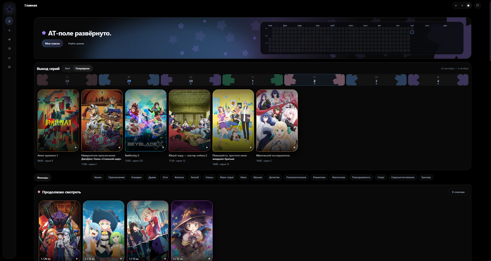
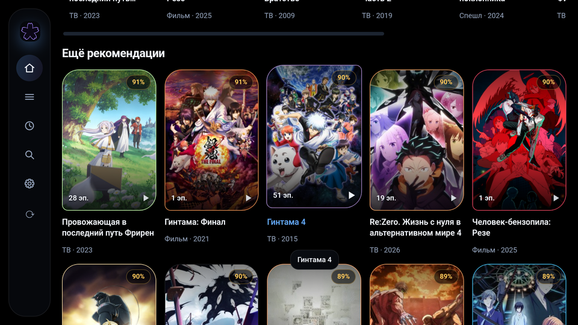
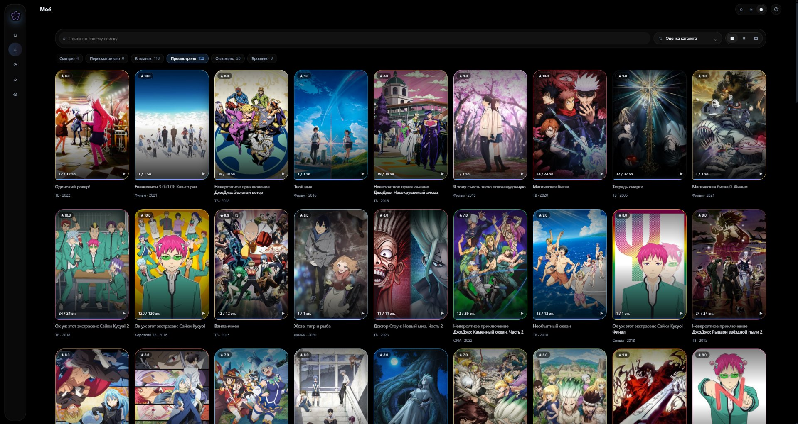
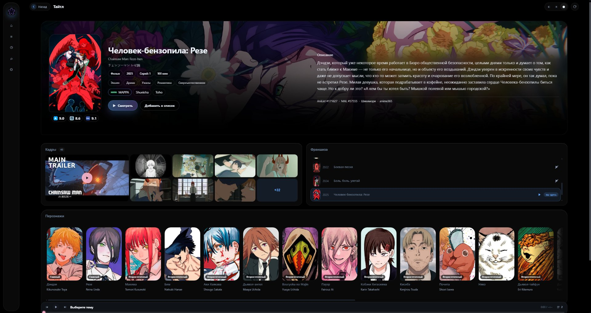
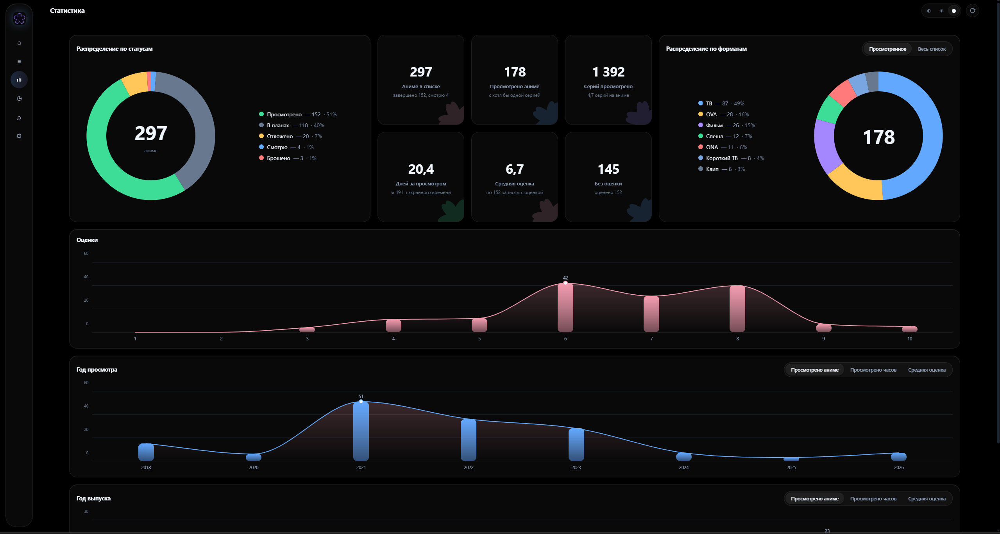
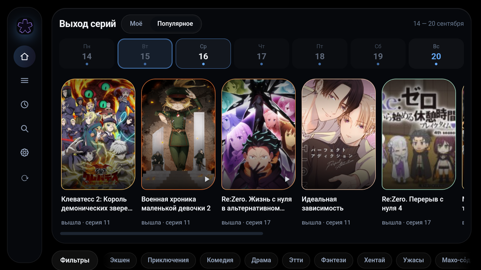
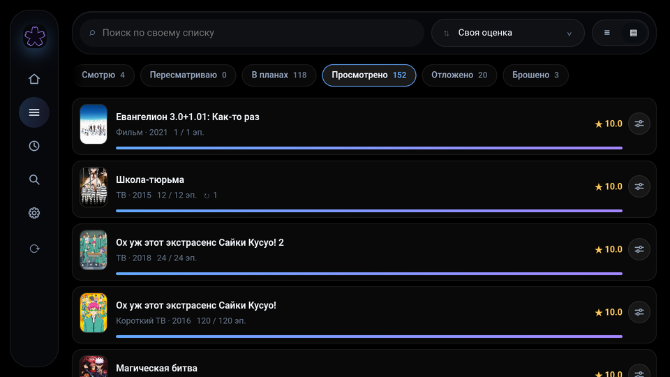

<div align="center">




# AniMori

**Клиент [AniList](https://anilist.co) со своим интерфейсом: настольное приложение
и приложение для телевизора. Списки, поиск, страницы тайтлов, встроенный плеер.**

[](https://github.com/foulnike/Animori/releases)
[](LICENSE)
[](apps/windows)
[](apps/android-tv)

[Настольное](#настольное-приложение) · [Телевизор](#приложение-для-телевизора) · [Возможности](#возможности) · [Сборка](#сборка) · [Устройство](#устройство-репозитория)

</div>

---

Приложение работает с AniList напрямую: само грузит данные, само рисует экраны,
подставляет русские названия и описания из Shikimori и anime365. Рекламы, телеметрии
и своих серверов нет: токен, настройки и кэш лежат на устройстве.

Проект неофициальный и с командой AniList не связан.

## Настольное приложение

Windows 10/11, мышь и клавиатура.

<p align="center">
  
  
  
</p>

[Установщик и портативный архив](https://github.com/foulnike/Animori/releases/latest) ·
[подробности](apps/windows)

## Приложение для телевизора

Android TV, Android 7.0 и выше, пульт.

<p align="center">
  
  
  
</p>

APK лежат в [выпусках](https://github.com/foulnike/Animori/releases): `AniMori_<версия>_armv7.apk`
для 32-разрядных приставок и `AniMori_<версия>_arm64.apk` для 64-разрядных.
[Подробности](apps/android-tv)

## Возможности

- **Плеер.** Выбор серии, озвучки и качества, два источника. История просмотра,
  продолжение с места остановки.
- **Список.** Живёт на устройстве, открывается без сети. Правка в шторке: статус,
  оценка, серии, пересмотры, даты, заметка.
- **Перенос списка.** Из AniList, с Шикимори по нику, файлом выгрузки MyAnimeList.
- **Выгрузка.** XML, который принимают AniList, Шикимори и Kitsu; копия в облако.
- **Тайтл.** Русское описание и названия, персонажи, студия, кадры, трейлер,
  опенинги и эндинги.
- **Статистика.** Время просмотра, свои оценки против оценок сообщества, кольца и
  столбики по годам.
- **Поиск.** По названиям, персонажам и авторам, на русском.
- **Настройки.** Темы, акцент, источник русских названий, прокси, журнал отладки.

## Сборка

Нужен Node.js 20 или новее. Для Android дополнительно Android SDK и NDK.

```bash
npm ci
npm test          # общее ядро и оба приложения
npm run typecheck
```

Разработка — из каталога приложения:

```bash
cd apps/windows && npm run tauri dev
cd apps/android-tv && npm run tauri -- android dev
```

Выпуск делается тегом: `windows-v3.0.5` или `android-tv-v3.0.3`.

## Устройство репозитория

| Каталог | Что в нём |
| :--- | :--- |
| `packages/core` | Общее ядро: данные, снимок, облачная копия, видео |
| `apps/windows` | Настольное приложение: экраны и оболочка |
| `apps/android-tv` | Приложение для телевизора: экраны и оболочка |

## Лицензия

[MIT](LICENSE). Русские названия и описания приходят из [Shikimori](https://shikimori.one)
и [anime365](https://anime365.ru); датасет собирается в
[animori-data](https://github.com/foulnike/animori-data).